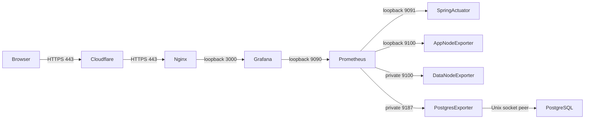

# PROD 운영 관찰

운영 주소: https://grafana.yanus.bond/ · 이슈: [#201](https://github.com/Yanus306/yanus-groupware-BE/issues/201)

## 대시보드

| 메뉴 | 용도 | 확인 지표 |
| --- | --- | --- |
| 01 전체 상태 | 장애 진입점 | 수집 UP, RPS, 4xx·5xx, P95, JVM, Hikari, 서버 자원, 현재 알림 조건 |
| 02 API 요청·오류 | 애플리케이션 병목 분석 | API별 요청·지연, JVM Heap·GC·Thread, Tomcat, Hikari |
| 03 로그 | 발생량·파일 보존 확인 | Logback 레벨별 발생량, 파일 존재·크기·보존 메타데이터, SSH 조회 절차 |
| 04 서버 자원 | app-server와 data-server 구분 | CPU·Load, 메모리·Swap, 디스크·I/O, 네트워크 |
| 05 PostgreSQL | 자체 운영 DB 분석 | 연결, 크기, 트랜잭션, 캐시, Deadlock, Tuple, Temp, DB 호스트 자원 |

PROD만 제공한다. 실제 운영 DB는 PostgreSQL이며 RDS·DEV 메뉴는 생성하지 않는다. 메뉴 이동 시 시간 범위와 호스트 선택을 유지한다. PostgreSQL 화면은 고정된 운영 DB를 조회한다.

`UP`은 exporter/scrape 연결 성공이며 업무 기능 전체의 정상 여부를 보장하지 않는다. Actuator와 Swagger 요청은 HTTP 대시보드의 업무 요청에서 제외한다. 요청이 없는 순간의 지연 백분위는 `요청 없음`으로 표시하고 과거 값으로 채우지 않는다. 시작 직후 rate 계산에는 최소 두 scrape가 필요하다.

## 상황별 도움말

각 화면 상단의 **도움말 · 어떤 상황에서 보고 어떻게 점검하나요?** 행을 펼치면 증상 → 확인 지표 → 다음 점검을 확인할 수 있다. 핵심 패널의 제목 정보 툴팁에도 해석과 후속 점검을 제공한다.

| 상황 | 시작 화면 | 확인 및 후속 점검 |
| --- | --- | --- |
| API가 응답하지 않음 | 01 전체 상태 | 수집 UP·DB 연결 → 실제 API 오류 → DOWN 대상 service/exporter/연결 |
| 5xx 증가 | 02 API 요청·오류 | 상태 코드·URI·요청량 → 03의 같은 시각 ERROR 원문 → DB·외부 서비스 |
| 4xx 증가 | 02 API 요청·오류 | 400·401·403·404 구분 → 요청 값·인증·권한·경로. 서버 재시작부터 하지 않는다. |
| P95·P99 증가 | 02 API 요청·오류 | 요청량 → GC Pause → Tomcat Busy/Max → Hikari Pending → DB·서버 I/O |
| Hikari Pending·Timeout | 02 및 05 | Active/Max·Acquire → DB 연결·긴 트랜잭션·느린 처리. 풀 크기부터 늘리지 않는다. |
| WARN·ERROR 원인 확인 | 03 로그 | 오류 시각을 KST로 맞춰 파일·journal을 조회하고 토큰·개인정보를 제거한다. |
| 로그가 없거나 metadata가 오래됨 | 03 로그 | 파일 권한·yanus 서비스·metadata timer/textfile 수집. 무요청과 수집 실패를 구분한다. |
| CPU·메모리·Swap 상승 | 04 서버 자원 | 해당 호스트 선택 → user/system/iowait·Available·Swap → API·JVM/DB 지연과 시각 비교 |
| 디스크 사용·I/O 지연 증가 | 04 및 05 | 여유 용량·read/write 지연 → 증가한 파일·작업 조사. DB·TSDB·로그를 임의 삭제하지 않는다. |
| DB 연결 DOWN·Deadlock | 05 PostgreSQL | DB 자체와 exporter 인증/socket 문제 구분; Deadlock은 같은 시각 로그와 트랜잭션 잠금 순서 조사 |

P95는 요청의 약 95%가 완료되는 시간이다. 적은 요청량으로 평상시 성능을 단정하지 않는다. Heap의 톱니 모양 회수, Linux Cache 사용, 일시적인 트래픽 변화는 관련 지표와 함께 해석한다. Cache Hit는 DB 활동이 있는 구간에서 해석한다. 조치 전 장애 시각·영향·근거를 기록하고 조치 후 같은 지표와 실제 API로 회복을 확인한다.

## 수집 구조와 포트



Cloudflare는 프록시 CNAME `grafana → api.yanus.bond`를 사용한다. 기존 외부 443 → app-server Nginx 443 경로를 재사용하므로 Grafana 3000의 추가 포트포워딩은 필요 없다. 80은 HTTPS 리다이렉트용이다. Grafana·Prometheus·Spring 관리 포트는 loopback에만 바인딩하고 DB 호스트 exporter 두 개는 private 주소에 바인딩하여 app-server 출발지만 UFW로 허용한다.

수집 간격과 규칙 평가 간격은 15초, 대시보드 갱신은 30초다. 모든 대상은 `environment=prod`, 역할별 `service`, `instance=app-server|data-server`를 갖는다. Prometheus 자체 상태까지 총 5개 대상을 수집한다. TSDB는 `/var/lib/prometheus/metrics2`에 최대 14일·2GB로 보존한다. Grafana와 Prometheus의 systemd 메모리 상한은 각각 512MB다.

Postgres Exporter는 OS `prometheus` 계정과 동일한 DB 역할로 Unix socket peer 인증을 사용한다. `pg_monitor` 및 `yanus` DB CONNECT 권한만 부여하며 업무 DB 비밀번호를 복사하지 않는다.

## 설치와 배포

현재 서버는 Ubuntu native systemd 구성이다. 사전 설치 패키지는 app-server의 `grafana`, `prometheus`, `prometheus-node-exporter`, data-server의 `prometheus-node-exporter`, `prometheus-postgres-exporter`다. Grafana는 공식 `apt.grafana.com` 서명 저장소를 사용한다. 최초 관찰 버전은 Grafana 13.2.3, Prometheus 2.45.3, Node Exporter 1.7.0, Postgres Exporter 0.15.0이다.

운영 중인 애플리케이션 JAR와 dev 브랜치의 업무 코드가 다르므로 이번 배포는 `observabilityBundle`로 관리 보안 구성과 Prometheus 의존성만 추가한다. Spring Boot PropertiesLauncher의 `loader.path`로 외부 JAR를 로딩하며 기존 `/home/yanus/app/app.jar`는 교체하지 않는다. DB 스키마를 변경하지 않는다.

```bash
JAVA_HOME=$(/usr/libexec/java_home -v 21) ./gradlew test build observabilityBundle
node ops/observability/generate-dashboards.mjs
scp -r ops/observability app-server:/tmp/yanus-observability
scp -r build/observability app-server:/tmp/yanus-observability-bundle
scp ops/observability/install-data.sh data-server:/tmp/yanus-install-data.sh
ssh data-server 'bash /tmp/yanus-install-data.sh DATA_PRIVATE_IP APP_PRIVATE_IP'
ssh app-server 'bash /tmp/yanus-observability/install-app.sh DATA_PRIVATE_IP /tmp/yanus-observability-bundle'
```

`DATA_PRIVATE_IP`와 `APP_PRIVATE_IP`는 운영 접속 문서의 실제 주소로 바꾼다. 스크립트는 root로 실행하며 기존 service 사용자·Cloudflare origin 인증서·Nginx가 존재해야 한다. 설치 시각별 설정 백업과 원본 JAR SHA256을 `/var/backups/yanus-observability/<UTC timestamp>`에 저장한다. 애플리케이션과 관찰 서비스를 재시작하므로 배포 시간에 실행한다.

파일 provisioning이 대시보드의 기준이다. UI 수정은 저장하지 않는다. JSON은 `generate-dashboards.mjs`에서 재생성하여 배포한다. Grafana 비밀번호와 secret key는 서버의 `/etc/grafana/yanus-admin-password`, `/etc/grafana/yanus-secret-key`에 `root:grafana 0640`으로 보관한다. 값은 Git·이슈·공유 캡처에 넣지 않는다. `grafana.ini`의 초기 admin 설정은 기존 DB 계정의 비밀번호를 자동 변경하지 않는다.

차후 승인된 전체 애플리케이션 배포가 Prometheus 의존성과 MonitoringSecurityConfig를 포함하면 외부 bundle 로딩을 제거하고 native ExecStart로 복구한다. loopback 관리 포트와 추가 설정 파일은 계속 사용한다.

## 로그

파일: `/var/log/yanus/prod/application.log`. 날짜·20MB 단위 gzip 회전, 최대 14일·300MB. 디렉터리는 `0750 yanus:yanus`, service UMask는 `0027`이다. 같은 파일에 logrotate를 중복 적용하지 않는다. 별도의 timer가 1분마다 파일 존재·크기·수정 시각·압축 파일 수를 Node Exporter textfile에 기록한다. 로그 본문은 Prometheus로 전송하지 않는다.

```bash
ssh app-server
sudo tail -n 200 /var/log/yanus/prod/application.log
sudo journalctl -u yanus --since '30 minutes ago' --no-pager
sudo grep -E 'WARN|ERROR' /var/log/yanus/prod/application.log | tail -n 100
sudo tail -n 100 /var/log/nginx/grafana-error.log
```

Loki·Tempo는 설치하지 않았다. 따라서 03 로그는 로그 본문 검색 화면이 아니다. 운영 장애 기록에는 발생 시각, URI, 상태 코드, request/trace 식별자 등 필요한 정보만 남기고 토큰과 개인정보를 제거한다.

## 알림 조건

| 규칙 | 조건 | 지속 시간 |
| --- | --- | --- |
| TargetDown | backend·node·postgres scrape UP=0 | 1분 |
| High5xxRate | 최근 5분 요청 20건 이상, 5xx 비율 >5% | 5분 |
| HighLatency | 최근 5분 요청 20건 이상, API P95 >1초 | 5분 |
| HighCpu | CPU >85% | 10분 |
| LowMemory | 가용 메모리 <10% | 5분 |
| DiskWarning / Critical | 루트 디스크 >85% / >95% | 5분 / 2분 |
| HikariPending | 연결 대기 >0 | 2분 |
| PostgresDown | pg_up=0 | 1분 |

규칙은 Prometheus에서 평가하고 01 전체 상태에서 Pending·Firing을 조회한다. 목록이 비어 있으면 현재 조건이 없는 것이다. 팀 알림 수신지는 지정되지 않아 외부 전송은 연결하지 않았다. 실제 송신을 완료했다고 해석하지 않는다.

## 검증

```bash
ssh -N -L 127.0.0.1:3300:127.0.0.1:3000 -L 127.0.0.1:39090:127.0.0.1:9090 app-server
# 다른 터미널
node ops/observability/verify-dashboards.mjs
GRAFANA_PASSWORD_FILE=/protected/path/grafana-password node ops/observability/verify-grafana.mjs
ssh app-server 'promtool check config /etc/prometheus/prometheus.yml'
scp ops/observability/yanus-rules*.yml app-server:/tmp/
ssh app-server 'cd /tmp && promtool test rules yanus-rules.test.yml'
```

verifier는 실제 Prometheus 쿼리 오류를 실패로 처리하고 빈 결과·NaN을 따로 보고한다. 정상 시 ALERTS는 비어 있고 무요청 구간의 histogram은 NaN일 수 있다. 이 값을 가짜 트래픽으로 채우지 않는다. 규칙 fixture는 운영 데이터와 분리된 promtool 테스트다.

배포 확인: 외부 HTTPS 로그인 리다이렉트, 미인증 API 차단, 5개 scrape UP, Grafana 5개 provisioning과 datasource health, 로그 권한·수집 timer, 기존 JAR checksum. Spring 보안 테스트는 실제 public/management 포트를 각각 호출하여 접근 경계를 검증한다.

## 장애 대응과 롤백

- Grafana 접속 실패: 공개 DNS → Cloudflare 프록시 → 기존 443 포워딩 → `nginx -t` → `systemctl status grafana-server` 순서로 확인한다. 새 DNS가 공용 resolver에서 정상인데 로컬만 NXDOMAIN이면 resolver의 음성 캐시 만료를 확인한다.
- API P95 증가: 02의 오류·URI → JVM GC·Tomcat Busy → Hikari Pending → 05의 DB 연결·트랜잭션 → 04의 디스크 I/O를 확인한다.
- 수집 DOWN: `systemctl status`, loopback/private 바인딩, data-server의 app-server 출발지 UFW 규칙, exporter의 실제 `/metrics` 응답을 확인한다.
- 로그 누락: 파일 소유권·UMask, `systemctl status yanus-log-metrics.timer`, textfile 수집 시각과 디스크 여유를 확인한다.

애플리케이션만 복구하려면 이번에 추가한 `/etc/systemd/system/yanus.service.d/observability.conf`를 백업 디렉터리로 이동하고 `systemctl daemon-reload && systemctl restart yanus`를 실행한다. 기존 ExecStart와 원본 JAR가 다시 사용된다. 기존의 다른 drop-in은 삭제하지 않는다. 이후 `/var/backups/yanus-observability/<배포시각>/application.sha256`을 검증한다.

관찰 서비스 전체를 중지할 때는 이번 서비스·timer만 중지하고 이번 Nginx symlink·Cloudflare grafana CNAME만 제거한다. 로그·TSDB·Grafana DB는 보존하고 기존 API/DB 포트와 DNS 레코드를 건드리지 않는다. exporter peer 역할은 사용 여부를 확인한 뒤 별도 정리한다.
