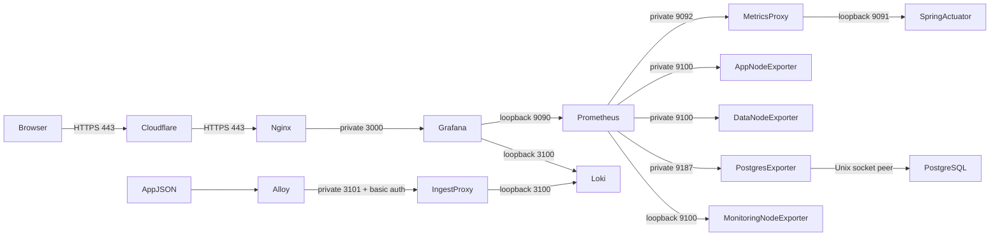

# PROD 운영 관찰

운영 주소: https://grafana.yanus.bond/ · 최신 작업: [#202](https://github.com/Yanus306/yanus-groupware-BE/issues/202) · 최초 구성: [#201](https://github.com/Yanus306/yanus-groupware-BE/issues/201)

2026-10-04 KST에 Grafana·Prometheus를 전용 `monitoring-server`로 이전하고 Loki 본문 검색을 추가했다. VM은 Hyper-V Generation 1, Ubuntu 24.04 LTS, 2 vCPU·고정 4GB·동적 VHDX 64GB이며 `C:\Hyper-V\monitoring-server`의 NVMe에 저장한다. 고정 MAC과 DHCP 예약으로 주소를 유지한다. 실제 주소·접속 계정은 비공개 운영 접속 문서를 사용한다.

## 대시보드

| 메뉴 | 용도 | 확인 지표 |
| --- | --- | --- |
| 01 전체 상태 | 장애 진입점 | 수집 UP, RPS, 4xx·5xx, P95, JVM, Hikari, 서버 자원, 현재 알림 조건 |
| 02 API 요청·오류 | 애플리케이션 병목 분석 | API별 요청·지연, JVM Heap·GC·Thread, Tomcat, Hikari |
| 03 로그 | 요청·예외 추적 | Loki 본문·요청 ID 검색, 예외 유형·스택, Logback 발생량, 파일 보존 상태 |
| 04 서버 자원 | 앱·DB·모니터링 서버 구분 | CPU·Load, 메모리·Swap, 디스크·I/O, 네트워크 |
| 05 PostgreSQL | 자체 운영 DB 분석 | 연결, 크기, 트랜잭션, 캐시, Deadlock, Tuple, Temp, DB 호스트 자원 |

PROD만 제공한다. 실제 운영 DB는 PostgreSQL이며 RDS·DEV 메뉴는 생성하지 않는다. 메뉴 이동 시 시간 범위와 호스트 선택을 유지한다. PostgreSQL 화면은 고정된 운영 DB를 조회한다.

`UP`은 exporter/scrape 연결 성공이며 업무 기능 전체의 정상 여부를 보장하지 않는다. Actuator와 Swagger 요청은 HTTP 대시보드의 업무 요청에서 제외한다. 요청이 없는 순간의 지연 백분위는 `요청 없음`으로 표시하고 과거 값으로 채우지 않는다. 시작 직후 rate 계산에는 최소 두 scrape가 필요하다.

## 상황별 도움말

각 화면 상단의 **도움말 · 어떤 상황에서 보고 어떻게 점검하나요?** 행을 펼치면 증상 → 확인 지표 → 다음 점검을 확인할 수 있다. 핵심 패널의 제목 정보 툴팁에도 해석과 후속 점검을 제공한다.

| 상황 | 시작 화면 | 확인 및 후속 점검 |
| --- | --- | --- |
| API가 응답하지 않음 | 01 전체 상태 | 수집 UP·DB 연결 → 실제 API 오류 → DOWN 대상 service/exporter/연결 |
| 5xx 증가 | 02 API 요청·오류 | 상태 코드·URI·요청량 → 03의 같은 시각 ERROR 원문 → DB·외부 서비스 |
| 4xx 증가 | 02 API 요청·오류 | 400·401·403·404 구분 → 요청 값·인증·권한·경로. 서버 재시작부터 하지 않는다. |
| P95·P99 증가 | 02 API 요청·오류 | 요청량 → GC Pause → Tomcat Busy/Max → Hikari Pending → DB·서버 I/O |
| Hikari Pending·Timeout | 02 및 05 | Active/Max·Acquire → DB 연결·긴 트랜잭션·느린 처리. 풀 크기부터 늘리지 않는다. |
| WARN·ERROR 원인 확인 | 03 로그 | 오류 시각을 KST로 맞추고 응답 X-Request-ID를 요청 ID에 입력한다. exceptionType·stackTrace의 원인 유형·위치를 확인한다. |
| 로그가 없거나 metadata가 오래됨 | 03 로그 | 파일 권한·yanus 서비스·metadata timer/textfile 수집. 무요청과 수집 실패를 구분한다. |
| CPU·메모리·Swap 상승 | 04 서버 자원 | 해당 호스트 선택 → user/system/iowait·Available·Swap → API·JVM/DB 지연과 시각 비교 |
| 디스크 사용·I/O 지연 증가 | 04 및 05 | 여유 용량·read/write 지연 → 증가한 파일·작업 조사. DB·TSDB·로그를 임의 삭제하지 않는다. |
| DB 연결 DOWN·Deadlock | 05 PostgreSQL | DB 자체와 exporter 인증/socket 문제 구분; Deadlock은 같은 시각 로그와 트랜잭션 잠금 순서 조사 |

P95는 요청의 약 95%가 완료되는 시간이다. 적은 요청량으로 평상시 성능을 단정하지 않는다. Heap의 톱니 모양 회수, Linux Cache 사용, 일시적인 트래픽 변화는 관련 지표와 함께 해석한다. Cache Hit는 DB 활동이 있는 구간에서 해석한다. 조치 전 장애 시각·영향·근거를 기록하고 조치 후 같은 지표와 실제 API로 회복을 확인한다.

## 수집 구조와 포트



Cloudflare는 프록시 CNAME `grafana → api.yanus.bond`를 사용한다. 기존 외부 443 → app-server Nginx 443 → monitoring-server의 private Grafana 3000 경로를 재사용한다. 추가 포트포워딩은 필요 없다. 80은 HTTPS 리다이렉트용이다.

| 서버 | 포트·바인딩 | 허용 범위 |
| --- | --- | --- |
| app-server | 관리 9091 loopback | 로컬 관리 및 scrape proxy |
| app-server | Nginx private 9092 | monitoring-server만 GET /actuator/prometheus |
| app-server | Node 9100 모든 IPv4 인터페이스 | UFW로 monitoring-server만 허용, 기존 loopback도 가능 |
| data-server | private 9100·9187 | monitoring-server 및 기존 app-server UFW 규칙 |
| monitoring-server | private 3000·3101 | app-server만; 3101은 basic auth 및 push 경로만 |
| monitoring-server | loopback 9090·3100·9100 | Prometheus·Loki·자체 Node 내부용 |

Loki 자체 인증은 끄고 loopback에 제한했다. 수집 게이트웨이가 source ACL·UFW·basic auth를 적용한다. Grafana 익명 접속과 회원가입은 비활성이다.

수집·규칙 평가 간격은 15초, 화면 갱신은 30초다. 모든 대상은 `environment=prod`, 역할별 `service`, `instance=app-server|data-server|monitoring-server`를 갖는다. backend 1·Node 3·Postgres 1·Prometheus 1로 총 6개를 수집한다. TSDB는 `/var/lib/prometheus/metrics2`에 최대 14일·2GB로 보존한다. Grafana 최대 1536MiB, Prometheus·Loki 각각 최대 1GiB, 앱 Alloy 최대 256MiB다. 이전 Grafana의 384MiB MemoryHigh는 새 서버에 적용하지 않았다.

Postgres Exporter는 OS `prometheus` 계정과 동일한 DB 역할로 Unix socket peer 인증을 사용한다. `pg_monitor` 및 `yanus` DB CONNECT 권한만 부여하며 업무 DB 비밀번호를 복사하지 않는다.

## 설치와 배포

현재 서버는 Ubuntu native systemd 구성이다. Grafana·Prometheus·Loki는 monitoring-server, Alloy·backend·Nginx·Node는 app-server, PostgreSQL·exporter는 data-server에서 실행한다. 실제 설치 버전은 Grafana 13.2.3, Prometheus 2.45.3, Node Exporter 1.7.0, Postgres Exporter 0.15.0, Loki 3.7.8, Alloy 1.20.1이다. Grafana·Alloy는 공식 서명 APT 저장소, Loki는 공식 release의 고정 SHA256을 확인한다.

운영 JAR와 dev의 DTO·업무 코드가 달라 `observabilityBundle`에 관리/감사 조회 보안, 공통 로깅, 호환 가능한 Email·MinIO·JWT 클래스 및 Prometheus 의존성만 포함한다. AuthService·컨트롤러 DTO·기존 업무 스케줄러는 포함하지 않는다. PropertiesLauncher의 `loader.path`를 사용하며 기존 `/home/yanus/app/app.jar`와 DB 스키마는 보존한다.

```bash
JAVA_HOME=$(/usr/libexec/java_home -v 21) ./gradlew test build observabilityBundle
node ops/observability/generate-dashboards.mjs
scp -r ops/observability monitoring-server:/tmp/yanus-observability
ssh monitoring-server 'bash /tmp/yanus-observability/monitoring/install-monitoring.sh APP_PRIVATE_IP DATA_PRIVATE_IP MONITORING_PRIVATE_IP'
scp -r ops/observability app-server:/tmp/yanus-logging-ops
scp -r build/observability app-server:/tmp/yanus-logging-bundle
ssh app-server 'bash /tmp/yanus-logging-ops/monitoring/prepare-app-scrape.sh APP_PRIVATE_IP MONITORING_PRIVATE_IP'
# Loki 수집 비밀번호를 보호된 경로로 전달한 뒤 실행한다.
ssh app-server 'bash /tmp/yanus-logging-ops/monitoring/install-logging.sh MONITORING_PRIVATE_IP /tmp/yanus-logging-bundle /protected/path/loki-password'
```

IP 자리표시자는 비공개 운영 접속 문서의 주소로 바꾼다. root로 실행하며 기존 service 사용자·origin 인증서·Nginx가 필요하다. 새 모니터링 설치 스크립트는 Grafana·Prometheus를 중지한 상태로 끝낸다. data-server의 9100·9187에 monitoring-server 출발지 UFW 규칙도 먼저 추가한다. 최초 설치 전용인 `install-app.sh`는 구 app-server 모니터링 구성을 다시 만들므로 이전 후에는 사용하지 않는다.

이전 순서는 다음과 같다.

1. 기존 Grafana·Prometheus를 중지하고 일관된 Grafana DB·plugins·암호화 키·관리 계정 파일 및 TSDB를 백업한다. app-server의 `monitoring-migration/state.tar.gz`에 보관한 뒤 기존 서비스는 검증 중 복구 경로로 재시작한다.
2. 새 서버의 중지된 서비스에 데이터를 복원하고 새 OS의 grafana/prometheus 소유자로 변경한다. 기존 DB 암호화 키를 반드시 함께 복원한다.
3. 새 서비스 시작 → 계정 인증·5개 provisioning·6개 UP·과거 TSDB 확인 → app Nginx Grafana upstream을 새 private 3000으로 바꾼다.
4. 공개 HTTPS 로그인·조회 확인 후 app의 이전 grafana-server/prometheus만 stop/disable한다. 파일·DB·TSDB는 삭제하지 않는다.

로깅 배포는 설정·bundle·OpenAPI·원본 JAR 해시를 `/var/backups/yanus-observability/logging-<UTC>`에 백업한다. 건강 상태는 최대 120회 확인하며 실패하면 이전 bundle/설정/Nginx를 복원한다. 재시작과 데이터 복사는 배포 시간에 실행한다.

파일 provisioning이 대시보드의 기준이다. UI 수정은 저장하지 않는다. JSON은 `generate-dashboards.mjs`에서 재생성하여 배포한다. Grafana 비밀번호와 secret key는 서버의 `/etc/grafana/yanus-admin-password`, `/etc/grafana/yanus-secret-key`에 `root:grafana 0640`으로 보관한다. 값은 Git·이슈·공유 캡처에 넣지 않는다. `grafana.ini`의 초기 admin 설정은 기존 DB 계정의 비밀번호를 자동 변경하지 않는다.

차후 전체 애플리케이션 배포가 이번 모든 관찰·보안·로그 클래스를 포함하면 외부 bundle 로딩을 제거하고 native ExecStart로 복구한다. loopback 관리 포트와 추가 설정 파일은 계속 사용한다.

## 로그

파일: `/var/log/yanus/prod/application.log`. 날짜·20MB 단위 gzip 회전, 최대 14일·300MB. 디렉터리는 `0750 yanus:yanus`, service UMask는 `0027`이다. 같은 파일에 logrotate를 중복 적용하지 않는다. 별도의 timer가 1분마다 파일 존재·크기·수정 시각·압축 파일 수를 Node Exporter textfile에 기록한다. 로그 본문은 Prometheus로 전송하지 않는다.

```bash
ssh app-server
sudo tail -n 200 /var/log/yanus/prod/application.log
sudo journalctl -u yanus --since '30 minutes ago' --no-pager
sudo grep -E 'WARN|ERROR' /var/log/yanus/prod/application.log | tail -n 100
sudo tail -n 100 /var/log/nginx/grafana-error.log
```

파일과 console에 한 줄 JSON을 기록한다. 요청 ID는 Nginx 생성 ID를 backend MDC·응답 헤더까지 공유한다. 직접 요청은 유효한 32자리 hex/UUID만 받아들이고 나머지는 새 UUID로 바꾼다. method·MVC 경로 템플릿·상태·elapsedMs를 남기며 인증/권한 단계에서 매핑 전 거부되면 `/unmatched`다. body·querystring·헤더·이메일·파일명·토큰은 추가 이벤트에 기록하지 않는다. 예외 메시지는 보관하지 않고 원인 클래스·스택 프레임만 기록한다. 로그 메시지의 credential/Bearer/JWT/email 패턴도 마스킹한다.

예상 업무 거절은 INFO, 원인 있는 4xx는 WARN, 5xx/예상하지 못한 예외는 ERROR다. 처리된 500은 handler ERROR 한 건과 완료 INFO 한 건을 공유 ID로 남긴다. SMTP/MinIO는 결과·시간만 기록하고 기존 예외 원인을 보존한다. 공통 스케줄러는 실행별 ID·시작·종료·안전한 실패 원인을 기록하며 다음 실행과 MDC가 섞이지 않는다. 스케줄러 실제 실행 경계는 로컬 native scheduler 테스트로 확인했으며 업무 cron을 강제로 실행하지 않았다.

Alloy는 파일을 읽어 JSON만 Loki에 전송한다. `alloy` 사용자에 디렉터리 탐색·현재/새 파일 읽기 ACL을 부여하며 쓰기 권한은 주지 않는다. requestId를 Loki label로 만들지 않고 JSON 필드로 검색한다. Loki 본문은 7일, batch_wait는 1초, 화면 최대 200줄이다. 빈 요청 ID는 전체 로그, 응답의 X-Request-ID 입력은 해당 요청이다. 이는 분산 tracing/Tempo 구현이 아니다. `/api/v1/audit-logs` GET은 ADMIN만 허용한다.

API Nginx access log는 requestId·method·status·elapsedSeconds·upstreamSeconds만 JSON으로 남긴다. IP·URL·query/body는 제외한다. 기존 과거 plain 로그는 백업/파일에 남아 있지만 Alloy JSON 수집에서 제외된다.

## 알림 조건

| 규칙 | 조건 | 지속 시간 |
| --- | --- | --- |
| TargetDown | backend·node·postgres scrape UP=0 | 1분 |
| High5xxRate | 최근 5분 요청 20건 이상, 5xx 비율 >5% | 5분 |
| HighLatency | 최근 5분 요청 20건 이상, API P95 >1초 | 5분 |
| HighCpu | CPU >85% | 10분 |
| LowMemory | 가용 메모리 <10% | 5분 |
| DiskWarning / Critical | 루트 디스크 >85% / >95% | 5분 / 2분 |
| HikariPending | 연결 대기 >0 | 2분 |
| PostgresDown | pg_up=0 | 1분 |

규칙은 Prometheus에서 평가하고 01 전체 상태에서 Pending·Firing을 조회한다. 목록이 비어 있으면 현재 조건이 없는 것이다. #204에서 Alertmanager와 외부 점검 코드를 추가했다. 목적지는 `yANUs / yanus-서버-알람`이다. 실제 웹훅 등록·운영 설치·기본 브랜치 예약 실행은 아직 완료되지 않았다.

### Slack 알림 구성

`ops/observability/alertmanager/`는 Ubuntu systemd와 Alertmanager 0.28.1 고정 checksum을 사용한다. 관리 API는 loopback 9093, 최대 메모리는 256MiB다. 웹훅은 `/etc/alertmanager/slack-webhook`의 `root:alertmanager 0640` 파일만 참조한다. 코드·Notion·이슈에는 값을 기록하지 않는다. 채널이 고정된 Incoming Webhook을 사용하며 다른 채널 접근 권한을 부여하지 않는다.

PROD 알림만 전달하며 environment/service/instance/alertname으로 묶는다. 첫 전송은 30초, 그룹 변화는 5분, 지속 장애 재통지는 1시간이다. 복구를 전송하고 같은 호스트의 DiskCritical은 DiskWarning을 억제한다. Alertmanager 자체 scrape DOWN 규칙도 추가했다. Prometheus와 Alertmanager가 함께 중단되면 이 경로로는 알림을 보내지 못한다.

설치 전에 보호된 웹훅과 설정 검토를 마친다. `install-alertmanager.sh`는 기존 파일을 root 전용 백업에 보관하고 활성화 실패 시 복원한다. Prometheus 설정은 주소 자리표시자를 현재 호스트 값으로 채운 별도 후보를 `promtool check config`로 확인한 뒤 백업·교체·reload한다. 최초 설치용 `install-monitoring.sh` 전체를 다시 실행하지 않는다.

### 외부 HTTPS 점검

GitHub Actions `uptime.yml`은 매시 7·17·27·37·47·57분에 공개 API OpenAPI와 Grafana `/api/health`를 확인한다. API 제목과 OpenAPI 3.x, Grafana database=ok를 검사한다. 200 HTML·리다이렉트·잘못된 JSON·비정상 상태는 실패이며 timeout/DNS/TLS/연결 오류를 구분한다. 각 요청 10초·최대 2회·응답 1MiB로 제한한다. 실제 응답 본문은 출력하지 않는다.

`SLACK_WEBHOOK_URL`은 GitHub Secret이다. 이전 예약 실행의 `probe-state-prod` artifact만 읽고, 30분보다 오래되거나 계약이 다른 상태는 UNKNOWN으로 취급한다. 장애 메시지가 실제 전송됐을 때만 복구를 전송한다. 전달 실패는 다음 점검에서 재시도하며 지속 장애는 1시간마다 다시 알린다. 수동 실행은 다른 concurrency 그룹과 artifact로 예약 상태를 변경하지 않는다.

이 워크플로는 기본 브랜치에 반영된 뒤 작동한다. Actions schedule은 지연·누락될 수 있고 공개 저장소의 활동이 60일 없으면 비활성화될 수 있다. 10분은 설정 간격이며 감지 시간 보장이 아니다. 최근 실행 시각을 직접 확인하고 감시 공백이 반복되면 별도 외부 감시로 전환한다. [GitHub 예약 실행 제한](https://docs.github.com/en/actions/reference/workflows-and-actions/events-that-trigger-workflows#schedule)

### #204 검증 근거 (2026-10-05)

외부 점검 테스트는 총9개 PASS이며, 실제 임시 HTTPS 서버의 신뢰되지 않는 인증서를 TLS 오류로 분류하는 검증도 포함한다. 인증서 검증을 비활성화하지 않는다.

실제 HTTP fixture에서 JSON·HTML·redirect·timeout·본문 크기·Slack 429/500/잘못된 응답을 확인했다. 실제 격리 Alertmanager와 HTTP 수신기로 장애·복구·중복·PROD 라우팅·디스크 억제를 검증했다. 이 수신기는 Slack mock이며 실제 채널 전달 증거가 아니다. 공개 주소의 읽기 전용 점검은 API 3,167ms, Grafana 1,122ms에 정상으로 관찰됐다. 단일 시점의 표본으로 SLO를 주장하지 않는다.

```bash
node --test ops/observability/*.test.mjs
node ops/observability/verify-alert-routing.mjs
docker run --rm --entrypoint promtool -v "$PWD/ops/observability:/work" -w /work prom/prometheus:v2.45.3 test rules yanus-rules.test.yml
# dry-run도 실제 공개 HTTPS를 읽지만 Slack은 보내지 않는다.
node ops/observability/public-probe.mjs --dry-run
```

상황별 조치와 중단 조건은 [운영 대응 절차](operations-runbook.md)에 있다.

### #204 운영 연결 (2026-10-05)

monitoring-server에 checksum 검증한 Alertmanager 0.28.1을 설치했다. `127.0.0.1:9093`만 리스닝하며 Prometheus에서 active Alertmanager와 자체 scrape `up=1`을 확인했다. 기존 임계치는 유지하고 10개 규칙과 도움말이 있는 5개 보드를 적용했다. Grafana provisioning·Prometheus/Loki datasource health는 모두 정상이다.

`Yanus Operations Alerts` 앱은 yANUs의 `yanus-서버-알람` 전용 Incoming Webhook 권한으로 설치했다. 서버 파일은 root:alertmanager 0640, GitHub Secret `SLACK_WEBHOOK_URL`도 등록했다. 값은 문서·로그·Git에 저장하지 않는다.

실제 서비스 장애 없이 `YanusNotificationConnectionTest`를 Alertmanager API에 전송했다. FIRING은 09:33:49 UTC, RESOLVED는 09:35:29 UTC에 실제 채널에 도착했다. 제목 링크가 내부 Alertmanager 주소로 향하던 문제는 공개 Grafana로 수정하고 후속 RESOLVED 메시지에서 확인했다. 검증 도중 설정 reload가 있었으므로 이 전달 시간은 정상 운영의 group_interval 또는 MTTD/MTTR 측정값으로 사용하지 않는다. 전송 실패 counter는 0이었다.

외부 점검은 Secret 등록까지 완료했다. `uptime.yml` 기본 브랜치 반영과 실제 Actions run/예약 실행 확인은 남아 있다. 전체 앱 교체·#203/V28·배포 복구 활성화는 수행하지 않았다.

## 검증

요청 내부의 HTTP·DB 처리 구간은 [PROD 요청 추적 운영 절차](tracing.md)와 **06 요청 추적** 보드를 사용한다. 기존 메트릭·로그 보드 및 requestId 필터는 유지하며 Loki↔Tempo를 traceId로 연결한다.

```bash
ssh -N -L 127.0.0.1:39090:127.0.0.1:9090 monitoring-server
# 다른 터미널
node ops/observability/verify-dashboards.mjs
GRAFANA_URL=https://grafana.yanus.bond GRAFANA_PASSWORD_FILE=/protected/path/grafana-password node ops/observability/verify-grafana.mjs
GRAFANA_URL=https://grafana.yanus.bond GRAFANA_PASSWORD_FILE=/protected/path/grafana-password REQUEST_ID=KNOWN_REQUEST_ID node ops/observability/verify-loki.mjs
ssh monitoring-server 'promtool check config /etc/prometheus/prometheus.yml'
scp ops/observability/yanus-rules*.yml monitoring-server:/tmp/
ssh monitoring-server 'cd /tmp && promtool test rules yanus-rules.test.yml'
```

verifier는 실제 Prometheus 쿼리 오류를 실패로 처리하고 빈 결과·NaN을 따로 보고한다. 정상 시 ALERTS는 비어 있고 무요청 구간의 histogram은 NaN일 수 있다. 이 값을 가짜 트래픽으로 채우지 않는다. 규칙 fixture는 운영 데이터와 분리된 promtool 테스트다.

2026-10-04 확인: Gradle test/build/observabilityBundle 274개 실패 0, 100 PromQL 오류 0, 6개 UP, Grafana·Loki health OK, 공개 계정 로그인, 실제 03 요청 ID 검색·04 모니터링 호스트, 로그 640·Alloy 읽기 ACL·수집 timer, 원본 JAR checksum·OpenAPI 일치. 실제 감사 조회 익명/MEMBER 403·ADMIN 200을 확인했다. 업무 변경 없는 origin Nginx의 invalid login body 한 건으로 안전한 INTERNAL_ERROR 응답·동일 ID의 ERROR 1/완료 1·스택·query canary 누락을 확인했고 Loki와 공개 UI에서 같은 두 건을 조회했다. Cloudflare를 경유한 해당 canary 요청은 403으로 차단되어 오류 검증은 origin 경로에서 수행했다.

이전에는 app Grafana의 MemoryHigh=384MiB 제한에 의한 high event 12,483회 및 메모리 PSI가 관찰됐다. 새 VM의 Grafana high/max/oom 및 메모리 PSI는 측정 시 0이었다. 짧은 사후 표본에서 서버 내부 30분 UP/CPU 조회는 Prometheus 0.9–2.0ms, Grafana proxy 7.8–10.2ms였다. Mac SSH 경유 3종 조회는 Grafana 26–108ms, 공개 HTTPS는 301–476ms였다. 공개 health 단일 요청은 이전 2.035초·이후 1.023초였으나 서로 다른 시각의 소표본이므로 개선율/SLO를 단정하지 않는다. 수집 15초·화면 30초의 갱신 대기는 처리 지연과 구분한다.

새 VM을 종료 후 고정 MAC으로 재시작하고 동일 IP·서비스 자동 시작·DB health를 확인했다. Persona의 read/receipt authority가 없어 필수 finish 게이트는 실제 테스트와 별도로 미통과 상태다.

## 장애 대응과 롤백

- Grafana 접속 실패: 공개 DNS → Cloudflare → 기존 app 443 → `nginx -t` → 새 VM private 3000 연결 → monitoring-server의 grafana-server 순서로 확인한다.
- API P95 증가: 02의 오류·URI → JVM GC·Tomcat Busy → Hikari Pending → 05의 DB 연결·트랜잭션 → 04의 디스크 I/O를 확인한다.
- 수집 DOWN: monitoring-server의 Prometheus targets → 해당 exporter/서비스 → 9092 Nginx 경로·loopback 9091 → monitoring-server 출발지 UFW 규칙을 확인한다.
- 로그 누락: Grafana Loki health → Loki·Alloy service/journal → push 인증 → 파일 읽기 ACL·JSON → timer/textfile 상태 순서로 확인한다.

이번 로그 배포만 복구하려면 Alloy를 중지하고 `logging-<UTC>`의 `lib`·application-observability.properties·Nginx yanus 설정을 원래 위치에 복원한다. 새 nginx-api-log.conf는 이전 백업 유무에 따라 복원/제거하고 nginx -t 후 reload, yanus restart 및 health·checksum을 확인한다. 기존 관리 구성을 유지한다. 이전 전부를 해제하려는 경우에만 observability.conf를 백업 위치로 옮겨 원래 ExecStart를 복구한다. 다른 drop-in을 삭제하지 않는다.

모니터링 이전 롤백은 app의 이전 Prometheus·Grafana를 enable/start하고 백업 `monitoring-migration/yanus-grafana`를 복원한 뒤 nginx -t/reload한다. 기존 state는 보존돼 있다. 새 VM 서비스는 원인 조사 후 중지하며 새 TSDB/Loki를 임의 삭제하지 않는다. 기존 백엔드·DB·443 설정은 유지한다.

관찰 서비스 전체를 중지할 때는 이번 서비스·timer만 중지하고 이번 Nginx symlink·Cloudflare grafana CNAME만 제거한다. 로그·TSDB·Grafana DB는 보존하고 기존 API/DB 포트와 DNS 레코드를 건드리지 않는다. exporter peer 역할은 사용 여부를 확인한 뒤 별도 정리한다.
