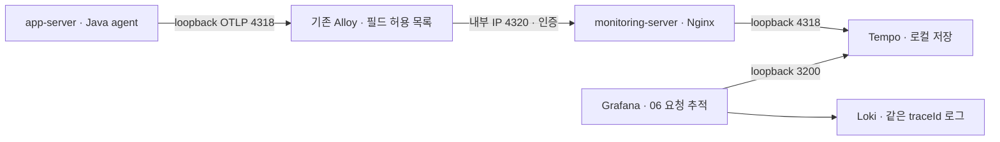

# PROD 요청 추적 · OpenTelemetry와 Tempo

Yanus의 요청 지연을 HTTP·JDBC·지원되는 외부 클라이언트 호출 구간으로 나눠 조사한다. 지표에서 증상을 찾고, 추적으로 긴 구간을 확인한 뒤 같은 traceId의 로그로 원인을 좁힌다. 성능 개선 결과와 부하 테스트는 별도 작업이다.

## 운영 구성



| 항목 | 설정 |
| --- | --- |
| 계측 | OpenTelemetry Java agent 2.32.0 · SHA256 검증 |
| 수집 | app-server의 기존 Alloy 1.20.1 · 로그 수집 구성 유지 |
| 저장 | monitoring-server Tempo 3.1.0 · 48시간 로컬 보관 |
| 샘플링 | traceidratio 0.1 · 부모의 sampled 비트를 그대로 따르는 parentbased 방식 아님 |
| 서비스 | yanus-backend · deployment.environment.name=prod · service.instance.id=app-server |
| 상관관계 | 기존 requestId 유지, JSON traceId/spanId/traceFlags 추가 |
| 연결 | Loki의 TraceID 링크 → Tempo, Tempo span → 같은 traceId의 Loki 로그 |
| 메모리 | Tempo MemoryMax 512MiB/GOMEMLIMIT 384MiB · Alloy 기존 MemoryMax 256MiB |
| 연결 제한 | Tempo 3200·4318·9096 loopback, 4320은 앱 내부 IP만 허용하고 인증 적용 |

기존 Loki가 사용 중인 9095를 관찰해 Tempo gRPC는 9096으로 분리했다. 기존 공개 Grafana 주소를 사용하며 라우터·Cloudflare에 새 공개 포트를 추가하지 않았다. Alloy→Nginx는 신뢰하는 내부 LAN의 HTTP이며 TLS 전송이라고 표현하지 않는다. 새로운 유료 서비스를 신청하지 않았다.

10%는 샘플링 확률 설정이며 매 10개 중 정확히 1개를 저장한다는 뜻이 아니다. 외부에서 전달한 traceId도 선택에 영향을 줄 수 있다. 제한된 큐·재시도·메모리 한도로 수집 실패가 업무 요청에 전파되지 않도록 구성한다. 운영에서는 업무 장애를 주입하지 않았고, 수집기 중단 검증은 격리 환경에서 수행했다.

## 어떻게 조사하는가

1. **02 API 요청·오류**에서 지연/오류가 증가한 URI와 시각을 찾는다.
2. **06 요청 추적**에서 느린 요청 기준과 시간 범위를 맞춘다. TraceID를 선택해 HTTP·DB·외부 호출 구간을 펼친다.
3. 긴 DB 구간과 반복 호출 수를 확인한다. 이 설정은 SQL 본문을 저장하지 않으므로 실행 계획·쿼리·연결 풀은 별도로 조사한다.
4. span의 로그 링크 또는 **03 로그**의 TraceID 링크로 같은 요청의 로그를 확인한다. requestId 필터도 계속 사용할 수 있다.
5. 원인을 수정한 뒤 같은 부하·시간 범위·데이터 조건으로 재측정한다. span은 중첩되므로 시간 합계를 요청 총 시간으로 단정하지 않는다.

### 추적이 없을 때

- traceFlags는 2자리 16진수이며 **최하위 비트**가 샘플링 여부다. 00/02 등은 미선택, 01/03 등은 선택이다. 00/01과의 문자열 비교로 판단하지 않는다.
- 로그에 traceId가 있어도 미선택 요청은 Tempo에 없을 수 있다. 48시간 이전의 데이터, 전송 지연, 큐 초과·수집기 중단도 확인한다.
- Tempo UP은 프로세스와 scrape 상태다. 실제 저장 성공은 traceId 조회와 전송 오류·수신 span 증가를 함께 확인한다.
- 같은 시간에 API도 실패했는지 별도로 확인한다. 관측 시스템 오류만으로 업무 장애라고 판단하지 않는다.

```traceql
{ resource.service.name = "yanus-backend" && duration > 100ms }
```

```traceql
{ resource.service.name = "yanus-backend" && (span.db.system.name = "postgresql" || span.db.system = "postgresql") }
```

```logql
{environment="prod",service="backend",instance="app-server"} | json | traceId="확인한_32자리_traceId"
```

## 민감 정보와 저장 한계

Agent에서 요청/응답 헤더·JDBC 매개변수 수집을 켜지 않았고 SQL sanitization을 사용한다. Alloy에서 resource·span·event 속성을 허용 목록으로 줄이고 span 이름·상태 메시지·이벤트 이름을 정리한다. 현재 HTTP/JDBC 경로의 URL 쿼리·SQL 본문·인증 헤더·프로세스 명령행·예외 메시지/스택이 Tempo에 남지 않는 것을 실제 fixture로 검증한다. 기존 Loki 로그 정책과 다른 정책이므로 추적에서 제거한 필드가 모든 기존 로그에서도 제거됐다고 주장하지 않는다.

현재 허용 속성은 HTTP method/status/route, DB system/operation, error.type과 서비스 식별자다. 추적이 개인정보 수집 허가를 대신하지 않는다. 향후 수동 span·event·link를 추가할 때는 새 데이터 경로도 검증해야 한다. span link 속성에 대한 별도 허용 목록은 이번 구성에 추가하지 않았다.

Tempo는 단일 VM의 로컬 디스크를 사용한다. HA·장기 보관·업무 데이터 백업을 제공하지 않는다. 48시간 보관은 정리 주기에 따라 즉시 정확한 삭제 시각과 일치하지 않을 수 있다. 수신 바이트·디스크 잔량·수집 오류는 운영하면서 함께 관찰한다.

## 적용과 검증

전체 애플리케이션 JAR를 교체하지 않고 `tracingJar`로 만든 로그 formatter 클래스 한 개만 PropertiesLauncher의 외부 경로에 추가한다. Java agent와 실행 drop-in도 별도로 설치한다. 운영 기준 소스는 `218f52250d63c3392cf63622ce3661a406d9c567`이며 JAR SHA256은 `e731ae295ac52b8eb391e0bfc980c6e23653b00a61f80b6b2b789ddb734ffeb5`다. 업무 로직과 Flyway V27은 유지한다.

```bash
./gradlew test bootJar tracingJar
docker build -t yanus-tracing-qa:217 -f ops/tracing/qa/Dockerfile .
node ops/tracing/qa/scenarios.mjs /protected/path/opentelemetry-javaagent.jar
```

QA는 임의 이름의 PostgreSQL·Tempo·Alloy·앱 컨테이너를 사용한다. 네트워크는 none/공유 namespace, 공개 포트 0, 운영 연결 0이다. 실제 HTTP→JDBC span·동일 traceId 로그, agent가 생성한 root traceFlags, 민감 속성 제거, 잘못된 traceparent 입력, Alloy 중단 중 API 정상 응답을 확인하고 컨테이너·임시 평문을 정리한다. CI도 고객 데이터·운영 SSH·비밀 없이 같은 fixture를 실행한다.

운영 설치는 root의 보호된 임시 디렉터리에 공개 설정과 formatter를 준비하고 별도 0600 인증 파일을 전달한 뒤 실행한다. 인증 파일의 내용을 CLI 인수나 Git에 넣지 않는다.

```bash
# monitoring-server
bash install-monitoring.sh 192.168.0.26 192.168.0.36
# app-server
bash install-app.sh 192.168.0.36 /protected/path/yanus-tracing.jar /protected/path/ingest-password
# monitoring-server
bash install-dashboard.sh /protected/path/06-traces.json
# Mac: 실제 읽기 요청으로 운영 연계 확인
node ops/tracing/verify-live.mjs
GRAFANA_URL=https://grafana.yanus.bond GRAFANA_PASSWORD_FILE=/protected/path/grafana-password node ops/observability/verify-grafana.mjs
```

설치 스크립트는 기존 설정을 `/var/backups/yanus-tracing`의 root0700 사본에 보관하고 실패 시 복구한다. 앱 설치는 CD와 같은 배포 잠금을 사용한다. 첫 agent 부팅이 약95초 걸려 90초 대기는 실패했고 기존 서비스가 자동 복구됐다. 설치 대기는180회로 늘렸다. 기존 CD 준비 상태 검증은120초이므로 이번 관찰값보다 길지만 향후 배포에서도 실제 기동 시간을 확인해야 한다. 이 시간은 단일 표본이며 평균/성능 개선 결과가 아니다.

Grafana의 비밀 없는 provisioning YAML은644로 두고 실제 native `192.168.0.36:3000/api/health`를 확인한다. 처음 root640으로 생성해 permission denied/502가 발생했고644로 수정 후 공개 화면 복구를 확인했다. Mac의 과거3300 터널 포트와 native3000 포트를 혼동하지 않는다.

Grafana datasource provisioning에서는 링크 매크로의 `$`를 `$$`로 이스케이프한다. 초기 설정은 TraceID 링크를 빈 검색어로 만들었고 실제 화면과 API 검증이 실패했다. Loki의 `$${__value.raw}`와 Tempo 로그 쿼리의 `$${__trace.traceId}`로 수정 후 API에 매크로가 보존되는 것을 확인했다. 실제 datasource 응답을 검사하는 검증에도 이 조건을 추가했다. [Grafana 공식 설정 문서](https://grafana.com/docs/grafana/latest/datasources/loki/configure/)

## 복구 절차

앱 설치 실패는 스크립트가 이전 Alloy·인증 파일·otel properties·drop-in·외부 formatter 디렉터리를 복구한 뒤 앱 준비 상태를 다시 확인하고 exit1로 종료한다. 전체 JAR와 DB를 되돌리는 절차가 아니다.

운영에서 추적만 중단해야 하면 먼저 마지막 정상 snapshot 경로를 확인하고 해당 Alloy 설정을 복원한다. 이번에 추가한 `zz-tracing.conf`만 제거해 기존 `zz-deployment.conf`의 실행 설정을 사용한다. daemon-reload와 Alloy/앱 재시작 후 readiness·메인/공개 API·JAR checksum을 확인한다. Tempo/대시보드는 원인 조사용으로 남겨둘 수 있다. snapshot 내용·인증 파일을 공개 로그로 출력하지 않는다.

향후 formatter가 변경된 JAR를 배포할 때는 외부 formatter도 같은 릴리스와 함께 검증·갱신해야 한다. 배포 drop-in의 사전식 순서상 zz-tracing.conf가 zz-deployment.conf보다 뒤에 적용된다. 기존 CD의 실패 복구는 drop-in 디렉터리 전체를 보관/복원한다.

## 작업 기록

- [이슈 #217](https://github.com/Yanus306/yanus-groupware-BE/issues/217) · 브랜치 `feat/#217`.
- 로컬278개 Java 테스트 실패·오류·skip0, bootJar/tracingJar 성공. Node 운영/배포 계약13개와 설치 ShellCheck 통과.
- 같은 실제 운영 baseline JAR를 격리 QA에 사용: HTTP/JDBC5span·로그 연결·root flags03·민감 필드 제거·잘못된 parent·수집기 중단 시 API 정상·정리 PASS.
- 실제 Grafana6개 UID·한국어 도움말·기존 requestId 필터 보존과 Prometheus/Loki/Tempo 데이터소스 health OK 확인.
- 실제 운영 읽기 요청40개 로그 중5개가 샘플링됐고 해당 HTTP200 traceId 조회·URL 쿼리 제거·JDBC 검색5건을 확인했다. 실제 수집/조회 증거이며 장기 샘플링 비율 측정값은 아니다. datasource를 거친 보드 TraceQL도200/traceID열을 확인했고100ms 이상0행은 정상 빈 결과다.
- 기존 PROD05의 백업 패널을 덮어쓰지 않고6번 이동 링크만 추가했다. 노션 운영 문서에도 실제 검증과 남은 한계를 구분해 기록한다.
- 실제 Grafana 화면에서 API 문서 읽기 요청의 TraceID 링크가 HTTP200·30.71ms span을 열고, 관련 로그 링크가 동일 traceId·requestId의 로그 한 건을 반환하는 것을 확인했다.

다음 작업은 별도 격리 부하 테스트와 병목 개선이다. 실제 외부 업무 연동을 호출하는 훈련과 장기 자원 영향 측정은 이번 완료 증거에 포함하지 않는다.
